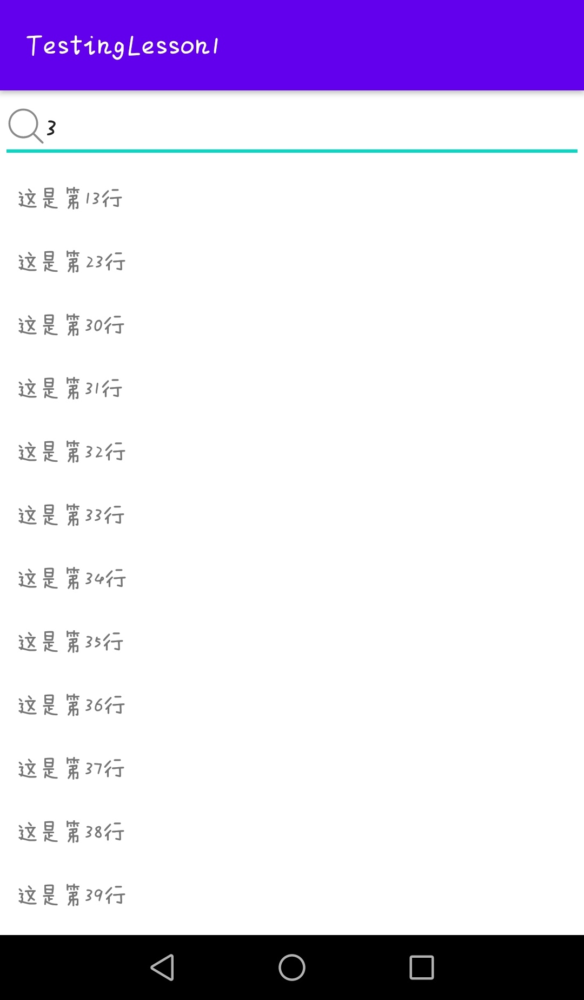
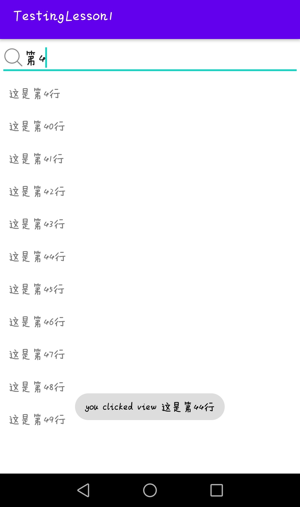

### APP说明

这是第二次Android课程作业，实现内容是完成一个android搜索列表页面，本人实现的效果如下：

这个App使用了RecyclerView并且配合Adapter使用，动态将数据展现到页面中，而搜索的功能是使用EditText完成，配合使用Filterable接口，可以根据关键字进行搜索和过滤。包含关键字都可以被搜索出来

如上图所示，当你点击某一特定的item时候，该页面会弹出对应的行的内容。