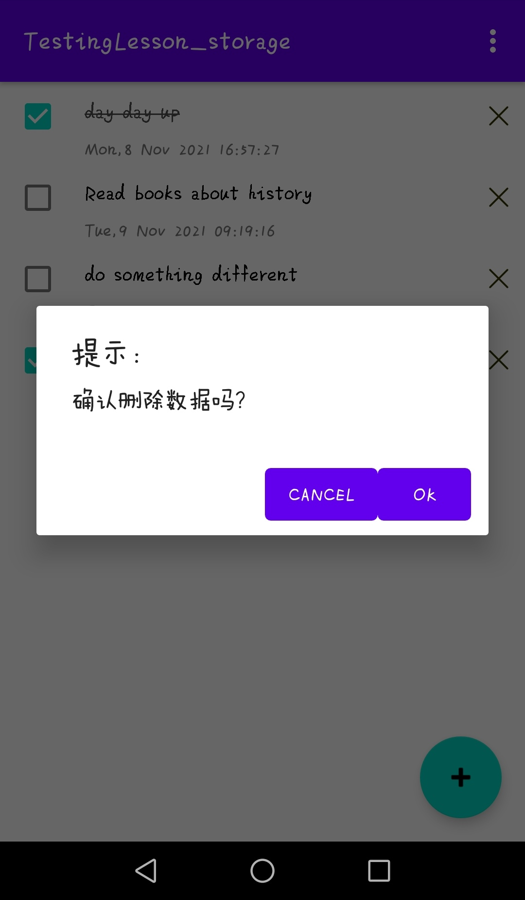
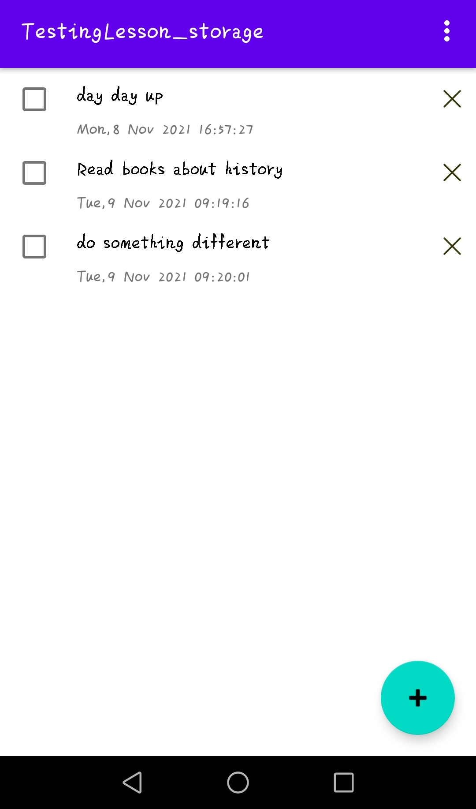
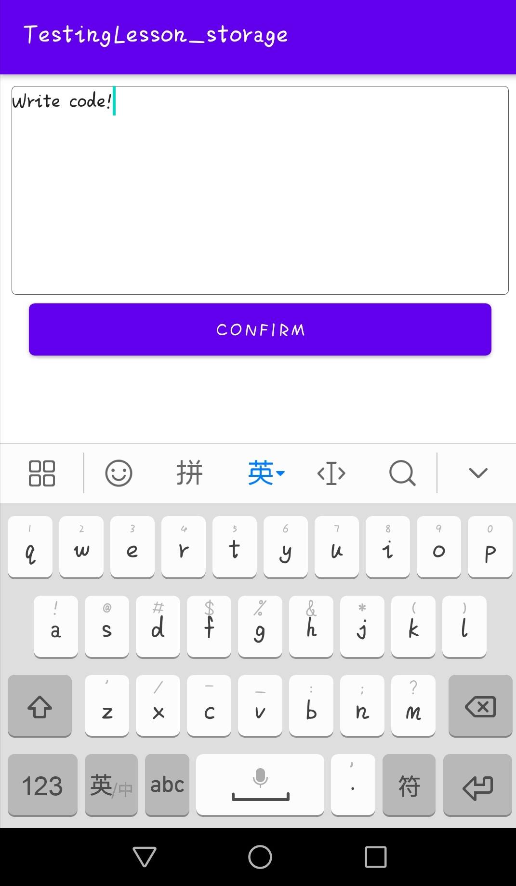
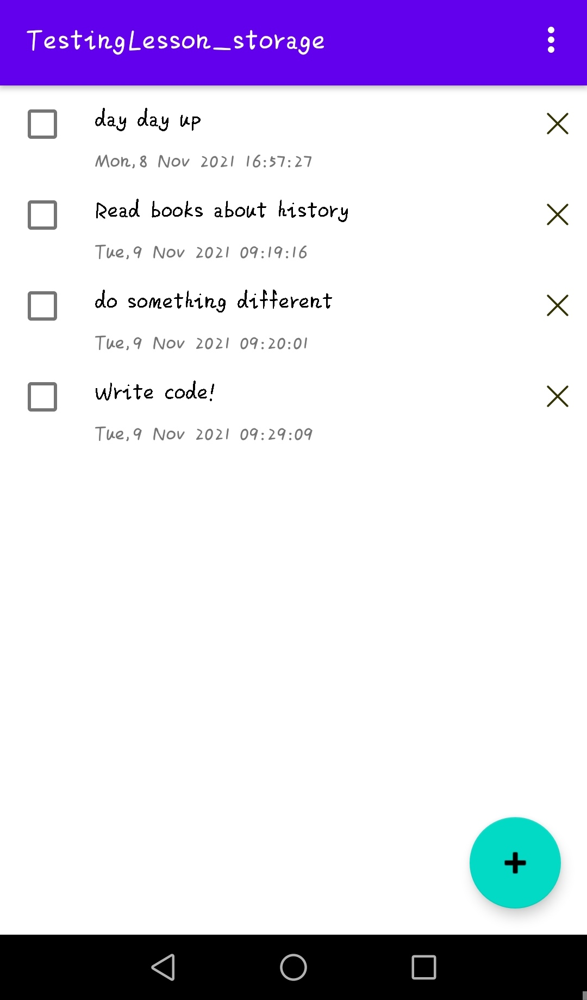
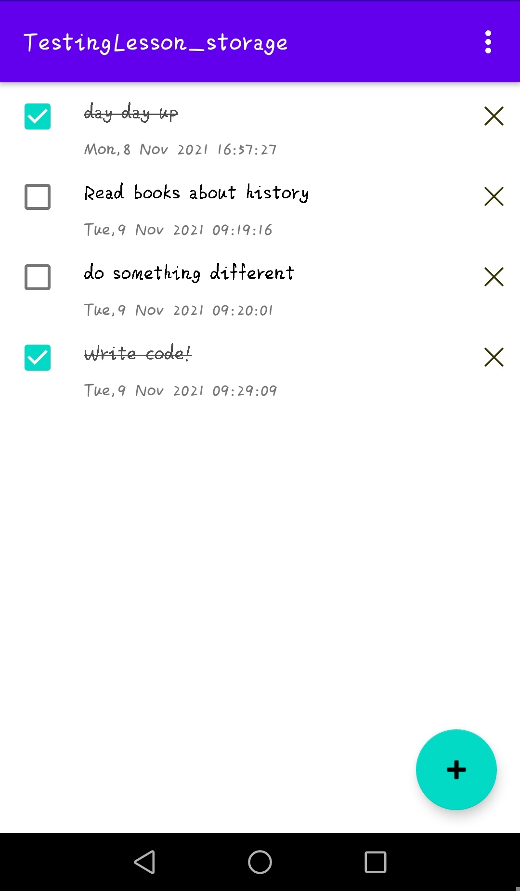

### App说明

该App为一个事项APP，使用sqlite数据库，存储数据。下面是存储了4条数据的主页面，表示有4条待办事项

当点击待办事项右边的“×”会弹出提示框：

当点击OK键之后会删除sqlite数据库中的该条数据，并更新页面

当点击页面底部的增加按钮之后可以进入添加数据的页面

点击confirm之后，可以看到主页面中成功更新并展现

同时在主页面点击checkbox可以更新数据库中数据的state状态

